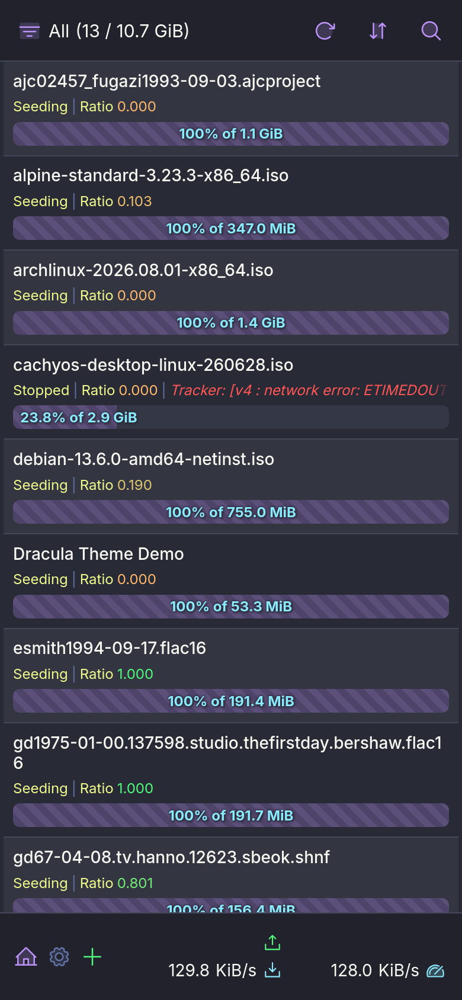
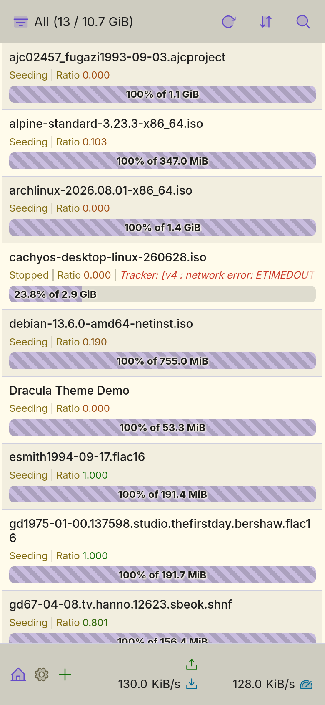
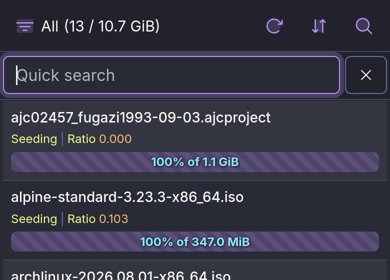
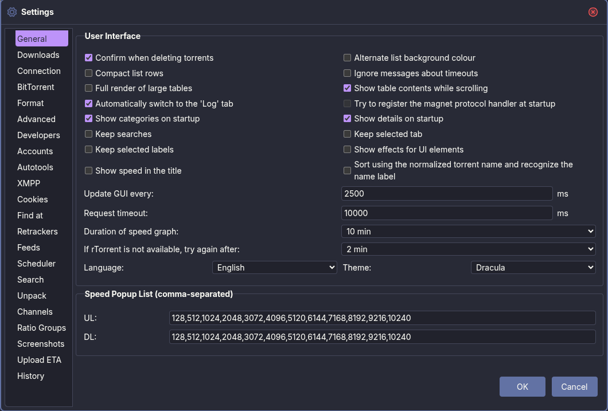
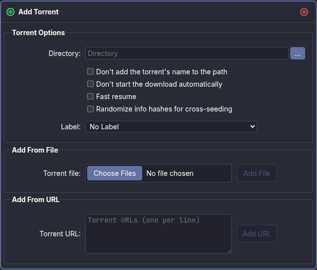
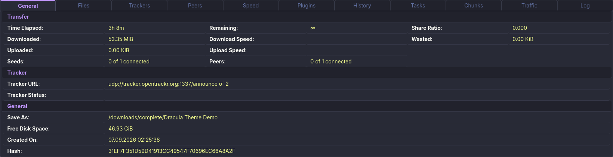
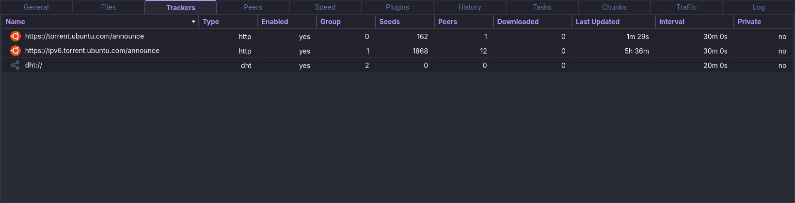

# What this theme does

Dracula is the palette. Most of the work is elsewhere: ruTorrent's interface was
built around small screens and raster sprites, and this theme reworks how it is
drawn, how it is navigated and what it tells you. Everything below lives in the
`Dracula/` folder.

## Keyboard control

The whole interface is reachable without a mouse.

**Regions — toolbar, sidebar, torrent list, detail tabs, status bar, and the
file list when it is showing.** Tab moves between them, arrows move inside one,
Home and End jump to its ends. Each region remembers where you were, so Tab
returns you to the row you left rather than to the top.

| Key                               | Does                           |
| --------------------------------- | ------------------------------ |
| `Tab`                             | Move between the regions       |
| `← ↑ → ↓`                         | Move inside a region           |
| `Enter`                           | Open or apply the focused item |
| `Space`                           | Toggle selection, or activate  |
| `Ctrl-Enter`, `Menu`, `Shift-F10` | Context menu, as a right click |
| `Shift-↑ ↓`                       | Extend the selection           |
| `Escape`                          | Close the menu and step back   |
| `F1`                              | The full list, on screen       |

Five bare letters act on whatever is selected: **S** start, **P** pause,
**T** stop, **U** reannounce, **R** force recheck. They are plain letters
because the mnemonic combinations are taken — Ctrl-P is Settings, Ctrl-O is Add
Torrent, Ctrl-F is search, and Ctrl-S, Ctrl-R and Ctrl-T belong to the browser.
Typing into a field or a dropdown never triggers them, and a force recheck of
more than one torrent asks first.

Context menus work the same way as under the pointer: arrows walk the items,
Right opens a submenu, Left closes it. Their shortcuts are printed in the menu
itself, next to the commands.

The torrent table is wider than its pane, so Left and Right scroll it by whole
columns and snap to column edges instead of drifting by pixels.

The Files tab takes the same keys, which is what makes its priority menu usable
without a mouse: arrows walk the entries, Shift-arrows take a run of them, and
the menu then sets the priority of the whole run at once. Nothing scrolls
sideways there, so Left and Right walk the tree instead — Right steps into the
folder under the cursor, Left steps back out.

Enter opens what there is to open: a folder by entering it, and a file by
offering its menu. A keypress never starts a download — that stays on the double
click, where it is asked for deliberately.

Dialogs take the keyboard as well, which is what carries the plugins with them:
Media Info, Spectrogram, Screenshots, Unpack and the torrent builder all report
through one shared window. Arrows walk the controls, Tab circles inside a modal
window rather than falling through to the page behind it, and closing one hands
the focus back to whatever opened it. Two rules keep the arrows out of the way
of the controls: a field gives an arrow up only when the caret reaches the end
of its text, and a dropdown does not change its value as you pass it.

## No image files

**The theme ships no images at all.** Every glyph is an inline SVG in the
stylesheet — 56 of them, defined once as custom properties and reused wherever
they appear, so one glyph is one definition rather than a copy per site. They
come from [Phosphor Icons](https://phosphoricons.com) (Duotone, MIT).

Upstream draws its interface from GIF and PNG sprites, fixed in size and blurred
on a HiDPI screen. Here everything is vector: the toolbar, the sidebar, torrent
status, file and directory rows, dialog headers, close buttons, the status bar,
the mobile navbar. Sharp at any zoom, and every glyph takes its colour from the
palette instead of carrying its own.

Both loading indicators are drawn too. The startup cover spins three dots in
CSS, and the toolbar's activity indicator is a web that stands still while the
UI is idle and turns while it waits on the server — the motion is the signal,
and hovering it says which of the two it is doing.

## A list that says what state a torrent is in

Upstream picks a torrent's icon by percentage, so a stopped download and a
stopped seed show either an alarm or praise, and nothing says "stopped". This
theme adds the state: a square inside a circle, drawn in Comment rather than
Orange, because a stopped torrent is not a problem.

The error flag is split by what it actually means. rTorrent's own errors stay
red. Announce noise — a tracker that did not answer, a release the tracker check
believes is gone — reads as a warning instead, because it is not the same class
of event as a torrent that cannot write to disk.

Status icons keep their contrast wherever the row goes. The quiet ones are
painted through a mask in the row's own colour, so a selected row does not
swallow them.

## Files, coloured by what they are

The Files tab paints each entry by what it is, so the eye finds a folder, an
archive or the way back up without reading a word: a directory in Orange, the
parent in Comment, and seven kinds taken from the extension — archive yellow,
disc cyan, video purple, audio green, image pink, document Comment. An extension
the theme has no answer for keeps the plain document, and nothing rests on
colour alone: each kind has its own glyph as well.

The flat view has icons at all for the first time — upstream draws them only in
the tree — so a file reads the same whichever view is on.

## One row height

Every list in the interface sits on the same grid: **30px per row**, and 26px
with ruTorrent's compact mode on. The torrent list, table headings, the sidebar
and its section headings, the detail tabs and the General tab's fields all land
on it, so the eye reads one rhythm down the page rather than four.

Table headings are exactly as tall as the rows beneath them and are told apart
by their paint alone.

## Typography

**The interface is set at 14px.** Upstream puts the whole page — body, inputs,
selects, buttons and textareas — at 11px Tahoma, which is small on a screen made
this decade. Every one of those gets the new size, so a field does not sit at
11px beside a 14px label.

Inter for the interface and JetBrains Mono for hashes and paths, both bundled as
`woff2` in 13 subsets with their OFL licences. Nothing is fetched from a CDN and
nothing depends on what the machine has installed.

## Notifications that say which kind they are

The four kinds ruTorrent raises — error, warning, success, information — are
tinted apart and each carries the Phosphor circle for its own state, so a
glance at the corner is enough. They stack in the bottom right, clear of the
status bar.

## On a phone

**ruTorrent's mobile plugin, and therefore this half of the theme, needs
ruTorrent 5.3.10 or newer** — the plugin does not exist below it. The desktop
floor stays 5.0.0.

The plugin brings its own interface and the theme follows it there: the list,
the filters, the torrent screen, the settings, and the bar along the bottom. The
file list is coloured by kind exactly as the desktop's is.

Both palettes are carried. Dracula is the default, and Alucard — the light
palette from the same specification — is what the plugin's Light setting gets,
rather than an inversion of the dark one.

## Details

- **Status bar sections explain themselves on hover** — disk space, CPU, open
  connections, torrent counts, listening port.
- **Dialogs are laid out for a landscape screen** rather than stacked into a
  column, and the ones that hold long lists were widened.
- **Seven breakpoints** carry the layout down to a phone, where the toolbar
  collapses into a navbar.
- **The theme checks itself on load.** Its stylesheets carry a version stamp
  that the script compares against its own, so a browser serving a cached
  stylesheet from an older release says so instead of rendering half-broken.

## What it needs

**ruTorrent 5.0.0 or newer.** The phone interface needs **5.3.10**, where
ruTorrent's mobile plugin first appears.

No dependencies, no configuration.

## Under the hood

Plain CSS and one script. No build step, no preprocessor, no framework. Copy the
folder into ruTorrent and pick it in Settings.

Every colour comes from the Dracula palette, declared once as custom properties.
No literal is written anywhere else.
