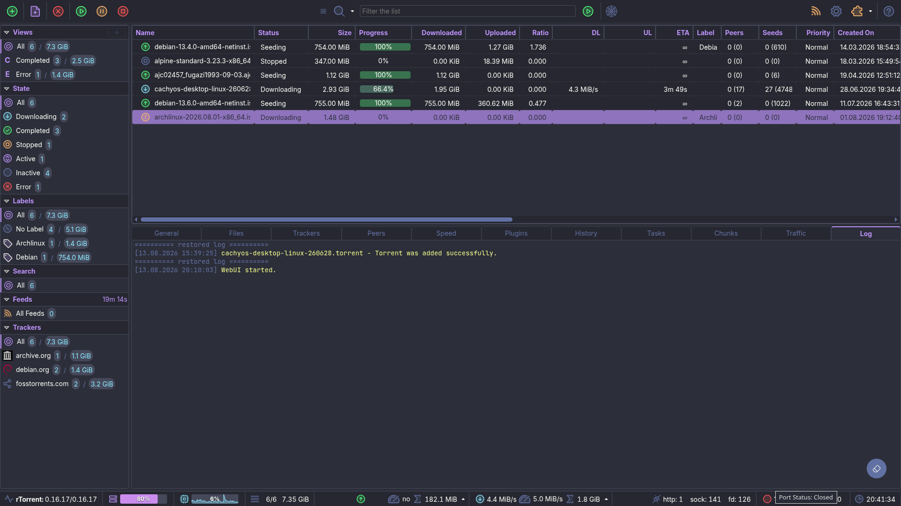

# Dracula for [ruTorrent](https://github.com/Novik/ruTorrent)

> A dark theme for [ruTorrent](https://github.com/Novik/ruTorrent).

## Features

Beyond the palette: full keyboard control, vector icons throughout, one row
height across every list, bundled fonts. Full list in
[FEATURES.md](./FEATURES.md).

## Install

All instructions can be found in [INSTALL.md](./INSTALL.md).

## Team

This theme is maintained by the following person(s) and a bunch of [awesome contributors](https://github.com/noctuum/rutorrent-dracula-theme/graphs/contributors).

|  |
| --------------------------------------------------------------------------------- |
| [noctuum](https://github.com/noctuum)                                             |

## Community

- [Twitter](https://twitter.com/draculatheme) - Best for getting updates about themes and new stuff.
- [GitHub](https://github.com/dracula/dracula-theme/discussions) - Best for asking questions and discussing issues.
- [Discord](https://draculatheme.com/discord-invite) - Best for hanging out with the community.

## Dracula PRO

## License

[MIT License](./LICENSE)
